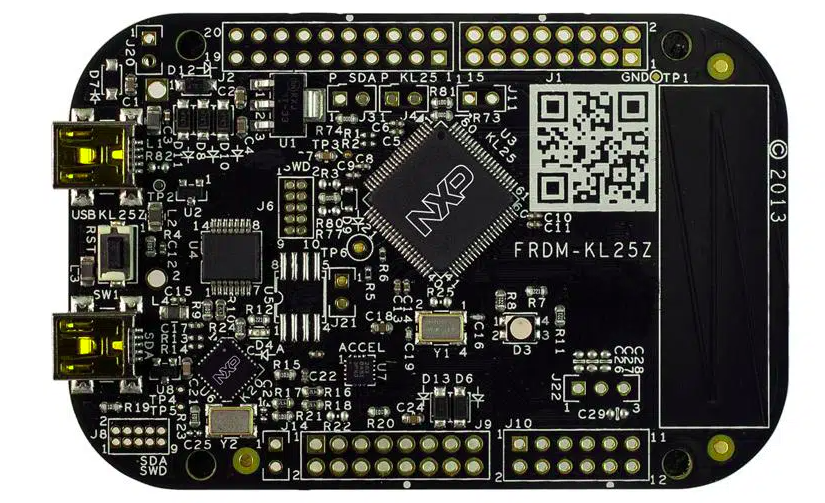

# Microcontroladores-2023.1

Repositório dedicado às atividades da disciplina de Microcontroladores na UFC - campus Quixadá.

## Ambiente de Desenvolvimento

- Linux POP!_OS 22.04 LTS

- MCUXpresso IDE

- FRDM-KL25Z Cortex-M0+

## Embedded Target

